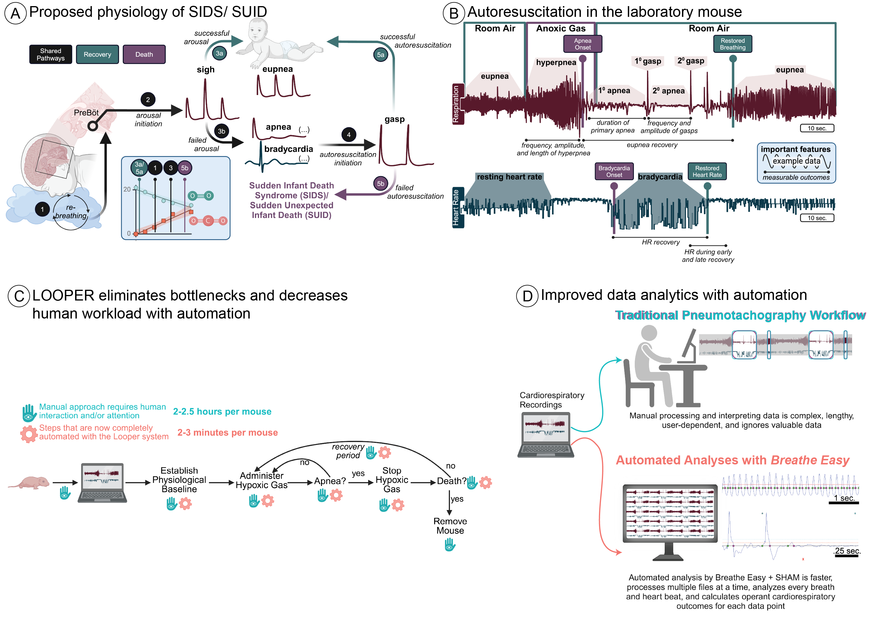

# LOOPER
Live Observation and Operation of Physiology Experiments with Robotics

# What is it?
LOOPER is an automated data collection platform for neonate pneumotachography experiments focused on the Autoresuscitation Reflex Assay. Its software is written in Python, and Arduino code (C++). The robotics includes commonly available electrical components, sensors, motors, and mechanical linkages. Structural components also include extruded aluminum pieces, 3D printed pieces, and milled acrylic. Physiology signals from laboratory grade sensors are captured using a LabJack analog to digital USB capture card connected to a Raspberry Pi Single Board Computer which provides access to the user interface. An Arduino Mega microcontroller with a custom assembled printed circuit board coordinates control of motorized parts.

Tools to aid in analysis of data collected with LOOPER are co-released at https://github.com/MolecularNeurobiology/Breathe_Easy

## What is the Autoresuscitation Reflex Assay? Why is it important?
The prevailing mechanistic hypothesis of Sudden Infant Death Syndrome/Sudden Unexpected Infant Death (SIDS/SUID) is that infants experience two critical failures that lead to death. The first is a failure of arousal. Many SIDS/SUID infants are found in an unsafe sleep environment, resulting in rebreathing increasingly hypoxic and hypercapnic air. Healthy infants arouse; however, in a vulnerable infant, the rebreathing continues, resulting in increasing levels of hypoxia and hypercapnia, leading to apnea and bradycardia. As a last line of defense, the infant initiates the **autoresuscitation reflex**. It is hypothesized that this second failure in the autoresuscitation reflex is a common mechanistic pathway for many SIDS cases. 

The neonatal mouse offers a powerful model for understanding intrinsic and extrinsic risk factors that may lead to failed autoresuscitation. Mouse neonate autoresuscitation parallels human cardiorespiratory physiology and can be readily assessed by subjecting a postnatal day 7-8 (P7-8) mouse to an anoxic gas mixture (3% CO2/97% N2) until apnea and bradycardia occur. Upon apnea, the neonate is returned to room air (approximately 21% O2/79%N2) to facilitate the autoresuscitation reflex and restore cardiorespiratory function. After a short recovery period, this sequence of events is repeated either for a predetermined number of trials or until the animal succumbs. 

However, the conventional autoresuscitation assay has several limitations that preclude wider use. First, the observer must be attentive throughout the assay to watch the cardiorespiratory traces in real-time, detect apnea, and provide room air rescue gas. This requirement for manual detection of cardiorespiratory signatures leads to inconsistency and inaccuracy. Second, an observer with one apparatus (pneumotachograph) can assay about three mice daily (~2.5 hours per assay). Given that mice must be P7-8, each litter is about eight pups, and each mating pair drops a litter once a month, it is impossible to record all mice, and there is a month’s downtime between experimental days. Ultimately, this culminates in wasted time and mice. Lastly, hand annotation and quantification of the data remain the standard in the field, creating an additional workload with the potential for observer bias. Altogether, these shortcomings create a high workload, low efficiency, and the potential for variability, severely limiting one of the most powerful assays for understanding SIDS mechanisms. 

While the **LOOPER** platform was created specifically to address experiments related to testing of the Autoresuscitation Reflex and SIDS/SUID, it provides an adaptable experimental framework that can be adapted to interrogate almost any aspect of neonatal cardiorespiratory function - making the platform useful for investigating a wide range of congenital or perinatal pathophysiologies (i.e. Rett Syndrome, Congenital Central Hypoventilation Syndrome, Neonatal Opioid Withdrawal Syndrome).

The **LOOPER** platform and accompanying data analysis tools from [BREATHE_EASY](https://github.com/MolecularNeurobiology/Breathe_Easy) now enable the automation of the assay and scaling of testing capacity, allowing a single investigator to test full litters of mice.



Figure 1. The role of autoresuscitation in SIDS and how automation improves testing that outcome in rodent models. (A) Schematic representation of the leading hypothesis behind the role of failed autoresuscitation in SIDS or SUID deaths. Numbers throughout the graphic indicate the numerical order in which the marked physiological events occur, and they also correspond to the estimated level of oxygen and carbon dioxide in the infant in the line graph on the lower center. This line graph is a figurative model and does not represent real data. (B) An example of a successful autoresuscitation response was measured in a laboratory mouse, and each critical physiological event was marked with bolded text. Additionally, we have highlighted some of the measurable outcomes from those physiological events in italicized text, which can be used to understand the dynamics of the response. Respiratory parameters are highlighted with maroon coloring, whereas cardiovascular parameters are highlighted in dark forest green. (C) A graphic demonstrating the required human interaction time for manual performance of this assay in lab rodents, as highlighted with the maroon hand with an eye. The "hand with eye" represents that a human must interact with the system and continue paying attention to perform interventions throughout this process. In contrast, our LOOPER system automates six of the eight steps, as demonstrated with the teal gear symbol, which reduces the required human interaction time by 98%. (D) Updates for the Breathe_Easy platform enable automation of data analysis for data generated on the LOOPER platform.

# Main Features
What does LOOPER do?

1. Real-time data collection using a LabJack analog to digital interface
1. Real-time detection of breathing and heartbeat
1. Automated closed-loop control of experiment steps via communications with an Arduino microcontroller and robotics components
1. Calibration air injections with a robotically actuated micropipette
1. Initiation of gas challenges with valve controls and motorized placement of gas exposure outlets
1. Identification of sustained apnea
1. Automated transition back to room air
1. Automated detection of cardio-respiratory recovery
1. Repetition autoresuscitation challenges

# Where to get it? How to build it? How to use it?
The software (available as source code), [build instructions](https://molecularneurobiology.github.io/LOOPER/doc/build/html/index.html) (including parts lists and schematics), and [user manual](https://molecularneurobiology.github.io/LOOPER/User_Manual/build/html/index.html) for conducting an Autoresuscitation Assay are available at our project repository for [LOOPER](https://github.com/molecularneurobiology/LOOPER).


## Where is the build manual?
Access the build guide for the robotics components [here](https://molecularneurobiology.github.io/LOOPER/doc/build/html/index.html). This provides parts lists of commercially available parts, fabrication instructions and specifications for custom 3D printed, milled, or PCB components, and an assembly and set-up guide.

## How do I set up the user interface software?
### Dependencies
The environment needed to run LOOPER can be created using a Python virtual environment tool (such as miniforge). A requirements.txt and pyproject.toml file enumerate the Python packages and versions that are suggested. Arduino code needed for flashing the microcontroller is available in the ArduinoCode subfolder

#### Installation and Usage - Python component
##### Install Python3
Download Python [here](https://www.python.org/downloads/)
or https://conda-forge.org/download/

##### Install Python Dependencies
Activate Python virtual environment to help manage package installation.
```
# Posix
python3 -m venv <venv>
source <venv>/bin/activate
```

Install dependencies
```
pip install -r requirements.txt
```

##### Running From Source
```
# Posix
source venv/bin/activate
python3 PCC.py
```


## How do I use LOOPER to perform an Autoresuscitation Assay?
Our user guide for interacting with the LOOPER system and its user interface is available [here](https://molecularneurobiology.github.io/LOOPER/User_Manual/build/html/index.html).


# Licensing
'LOOPER' is dually licensed. The project is available under a 'GPLv3 or later' license as well as a commercial license (inquiries for commercial licensing may be directed to Russell.Ray@bcm.edu). 

    LOOPER - Live Observation and Operation of Physiology Experiments with Robotics
    Copyright (C) 2019  
    Christopher Ward, Nicoletta Memos, Savannah Lusk,
    Mariana Garcia Costa, Wenyu Zuo, Eunice Aissi, Brandon Ruiz, 
    Dipak Patel, Kevin Jiang, Andersen Chang, and Russell Ray.

    This program is free software: you can redistribute it and/or modify
    it under the terms of the GNU General Public License as published by
    the Free Software Foundation, either version 3 of the License, or
    any later version.
