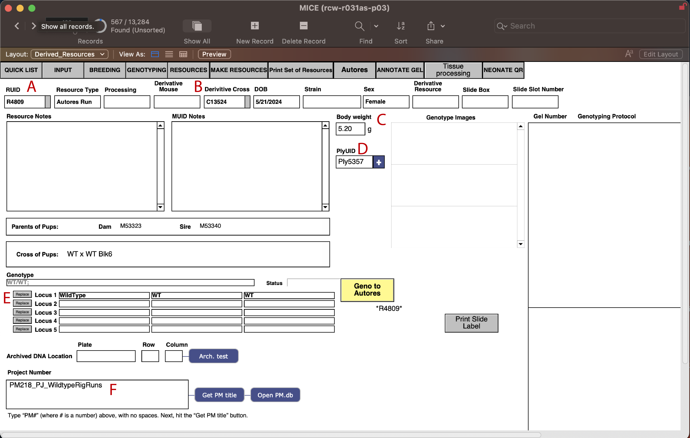
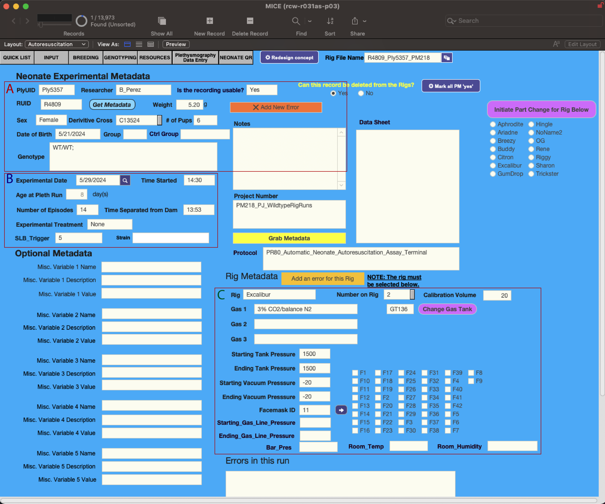
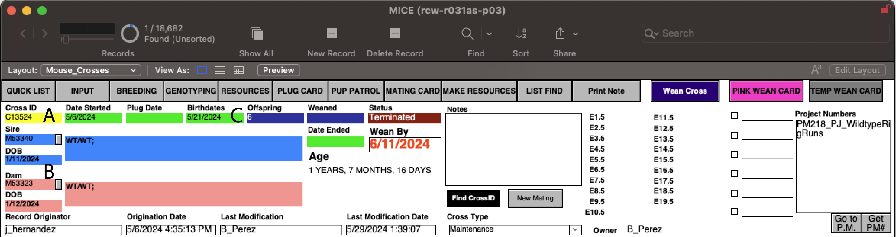
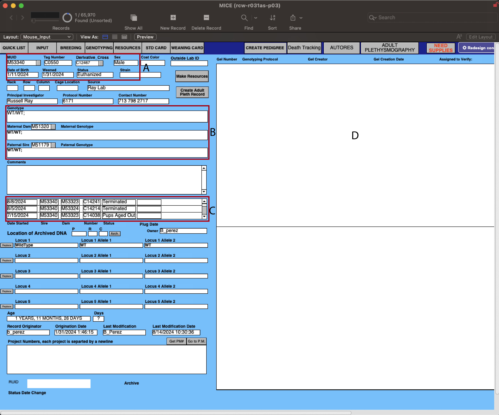

Database and Nomenclature Overview
===================================

This page explains the lab-specific terminology and abbreviations used throughout this manual.
It will also give in overview on the database that is used in the lab to keep track of the animals and experiments.
The lab uses Filemaker Pro to manage the databases.

Resources Database
------------------

   Derived Resources Database

The resource database is used to initially create a unique identifier for each mouse pup that is ran on LOOPER in the Ray lab. 
It allows us to keep track of all the necessary information for each pup that is crucial for the metadata and post-hoc processes.

A. **RUID** - A unique identifier assigned to each experimental run on a rig. This identifier is generated in the Derived Resources database and is used to track what resource was used for each run (a pup in this case).
B. **Derivative Cross** - Refers to the Cross Unique Identifier (CUID) that is used to track the parents from which the pups were derived from.
C. **Sex and Weight** - This is where the sex and weight of the pups are recorded.
D. **PlyUID** - Plythesmography Unique Identifier - This is a unique identifier for the plythesmography experiment that is linked to the Autores database.
E. **Genotype** - The genotype of the resource (pup) can be put in here and it will be linked to the Autores database as well. Gel's confirming the genotype will appear in the right white box.
F. **Project Number** - Each resource is connected to a PM number. This is used to keep track of which resources are apart of which project along with all the associated information.

Autores Database
----------------

   Autores Database

This database is contains information for each experiment that was run on the LOOPER rig. It links all the metadata from the Derived Resources database and contains other sources of information
that allows us to keep track of what components were used.

A. Contains the **PlyUID (Plythesmography Unique Identifier)** that is generated along with the information from the Derived Resources database and Breeding Log database.
B. Contains information about the experiment such as the date ran, age of pup (automatically calculated), number of episodes survived, experiental tratements (i.e, if an injection was given or not), time serpeated from dam, and time experiment started.
C. Contains information about the run such as LOOPER (rig) used, number of run on that day, **gas tank identifier (GTID)**, pressure before and after the run of the gas tank, along with vaccum pressure, and which face mask was used.

Breeding Log Database
---------------------

   Breeding Log Database

This database is primarily used to keep track of the matings which allows us to derive the pups used for experiments.

A. **Cross Unique Identifier (CUID)** - A unique identifier assigned to each mating cross and which cross the pups are derived from.
B. **Mouse Unique Identifier (MUID)** - A unique identifier assigned to each mouse and lists the Sire and Dam that were used for breeding, along with their genotypes, to produce the pups.
C. **Birthday and Number of Offspring** - This is where the birthday of the pups is recorded and the number of pups born for that cross. 

Mouse Database
--------------

   Mouse Database

This database is not extensivly used for the LOOPER experiments directly. It is mainly used to keep track of the parents of the pups that that are used for experiments.

A. Shows the **Mouse Unique Identifier (MUID)**, tag number for the ear tag the mouse is given, which cross the mouse is derived from, date of birth, when it was weaned, and the current status.
B. Shows the genotype of the mouse along with the which Sire and Dam it was derived from with their associated genotypes.
C. Shows all the **Cross Unique Identifiers (CUID)** that the mouse was used in.
D. This area is where the genotyping gel is uploaded for the mouse if there is one.

Software and Equipment
----------------------
eMouse
   A calibration device used to test rig functionality and troubleshoot errors. When reporting errors, it's important to determine if the error can be reproduced with the eMouse, as this helps isolate whether the issue is with the rig hardware or the experimental subject.
