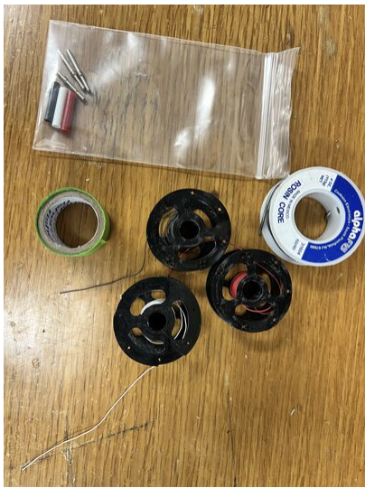
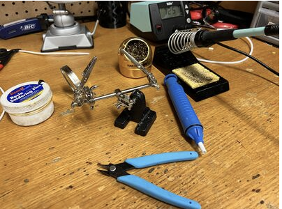

Making ECG Leads
================

This guide explains how to construct ECG leads for use with the LOOPER system.

Materials Required
------------------
- ECG Pins
- Tape
- Solder with Rosin Core
- Red, White, and Black cooper leads

Equipment Required
------------------
- Soldering Iron
- Solder Flux
- Wire Cutters
- Clamp
- Brass
- Wet Sponge

Construction Steps
------------------

1. Clean the solder by dipping it into the solder flux and then whipping it off in the brass and the wet sponge.

   .. image:: Images/ECG_Leads/Step1.png
      :width: 100px
      :height: 100px

2. Apply tape to on side of the holders to cover the teeth. This prevents damage to the wire when it will be help by it.

   .. image:: Images/ECG_Leads/Step2.png
      :width: 100px
      :height: 100px

3. Place an ECG pin on the other side of the holder with the opening facing up.

   .. image:: Images/ECG_Leads/Step3.png
      :width: 100px
      :height: 100px

4. Using the wire cutters, cut a piece of the copper leads.

   .. image:: Images/ECG_Leads/Step4.png
      :width: 100px
      :height: 100px

5. Strip a small amount of the lead on one side to expose the copper wiring.

   .. image:: Images/ECG_Leads/Step5.png
      :width: 100px
      :height: 100px

6. Use the holder, tape side, to hold the wire upright.

   .. image:: Images/ECG_Leads/Step6.png
      :width: 100px
      :height: 100px

7. Use the solder and the soldering iron to coat the exposed copper wire with solder.

   .. image:: Images/ECG_Leads/Step7.png
      :width: 100px
      :height: 100px

8. Add a small amount of solder to the the ECG pin.

   .. image:: Images/ECG_Leads/Step8.png
      :width: 100px
      :height: 100px

9. Melt the solder in the ECG pin and slide the coated wire in.

   .. image:: Images/ECG_Leads/Step9.png
      :width: 100px
      :height: 100px

10. Strip a small amount of the ECG lead on the exposed side.

    .. image:: Images/ECG_Leads/Step10.png
       :width: 100px
       :height: 100px

11. Use the Multimeter to test for connection.

    .. image:: Images/ECG_Leads/Step11.png
       :width: 100px
       :height: 100px

12. Apply the respective colored cap to the ECG pin and you are done.

    .. image:: Images/ECG_Leads/Step12.png
       :width: 100px
       :height: 100px

