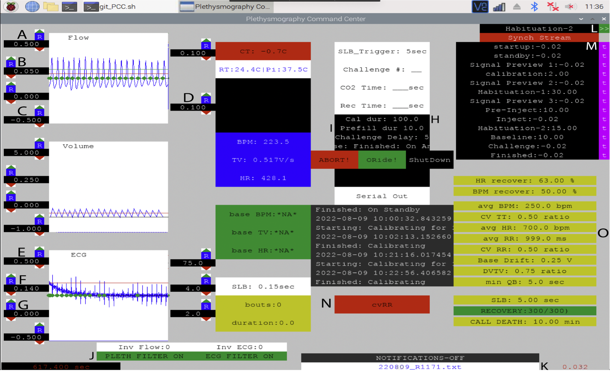

.. note::
   This manual uses Ray lab-specific terminology, abbreviations, and opporational methodologies. 
   For detailed explanations of terms like CUID, RUID, GTID, PM folder, and eMouse, please refer to the :doc:`Database and Nomenclature Overview <Database>` page.

Startup Check List
==================

-  Power on LOOPER

-  Power on the water baths

-  Check to make sure gas tank valves are open (down position for yellow
   knob)

-  Make sure the vacuum is on (Flowmeter: silver ball at 10 and black
   ball at 20)

-  Make sure all air bubbles are removed from the water baths

-  Each LOOPER has its own set of calibration mask and facemask
   - Facemasks can be interchanged between each LOOPER platform

-  ECG box is on and switch is on AC

-  Validyne box is on

-  Arduino is on

-  git_PCC is running

-  And Finish Startup process is completed without issues

Materials List
==============

-  Impregum base pate + Catalyst Paste

-  Facemask – each LOOPER should have its own set (pup and calibration
   facemask)
   - Facemasks can be interchanged between each LOOPER platform

-  Swabs

-  Conductive Paste

-  ECG Leads (see :doc:`Making ECG Leads <Making_ECG_Leads>`)

-  Super glue

Important Notes Before Starting
===============================

-  Heed the advice given in the *order of operations* section below as
   it will streamline your operations.

-  **Facemask tips**

   -  **IT IS IMPORTANT** to avoid getting any paste on the pups mouth or
      nose as it will impact the breathing and the run.

   -  **FOR BEST RESULTS** form a bead of the impregum paste and apply it 
      to were the eye of the pup is and bring it down to the neck and to the other 
      eye. Then take some more and apply it to the top of the head and completing the 
      circle to the other eye.

-  **ECG tips**

   -  **IT IS IMPORTANT** that none of the conductive paste spots of the
      leads overlap with each other; this will result in a noisy signal.

   -  It is best to place the red and black leads on with just the
      conductive paste first and verify a good signal being recorded in
      the GUI. This allows you to make adjustments without needing to
      rip off superglue, re-strip the wires, and reapply the conductive
      paste and glue every time.

   -  If you experience noise on the ECG channels, but have a decent
      signal, try gently pulling on the wires from behind to apply
      tension. Sometimes this helps the signal and resolves noise
      nicely.

-  Pay attention to the LOOPERs during the startup process. This will be
   your best opportunity to find out if you will experience errors
   during your run that will prevent you from being able to use that
   recording.

   -  Look for the following:

      -  Calibration waveform on GUI

      -  Motor function

      -  Gas valves operational and audible gas exiting when
         challenge gas valve opened.

-  Be sure to record all of the following metadata surrounding your
   experiments. These data are essential to record as they cannot be
   retroactively collected. Other data may be included in a datasheet
   you use during collection, but these data are the most essential.

   -  CUID

   -  RUID

   -  Sex

   -  Weight

   -  DOB

   -  Age

   -  LOOPER name (if more than one LOOPER platform is present)

   -  Number of run on that LOOPER that day

   -  Gas tank ID (GTID)
      - This is Ray Lab specific

   .. note::
      For explanations of lab-specific terminology and abbreviations (such as CUID, RUID, GTID, PM folder, git_PCC, etc.), see the :doc:`Database and Nomenclature Overview <Database>` page.

-  Make notes on components that are not working or if you notice
   something out of the ordinary during the run. See *reporting errors*
   section below.

Order of Operations QuickStart for the Ray Lab
==============================================

1. Turn on water heater and water pump.
   - Water pump is needed if multiple LOOPERs are being used on the same water bath

2. Generate RUIDs for each mouse you intend to run on the Derived
   Resources database and enter just the CUID for each of those mice.
   Make 5 entries at a time (or however many LOOPERs are currently
   functional).

3. Turn on each LOOPER:

   a. Ensure you have a PM folder for your project on that LOOPER.

   b. Run git_PCC.sh and execute in the terminal and adjust all window sizes and settings (if needed).

   c. Push through the protocol until you get to Signal Preview 2 and
      save the file.

4. Prior to retrieving each mouse for the run, put a small dab of both
   the Impregum base paste with a small line of the catalyst next to
   each dab on the prep tray.

   a. This saves a lot of time because for each LOOPER as you go along you
      can immediately start mixing and placing the facemask without
      having to open and close the Impregum tubes each time. This also
      makes it easier to use smaller amounts of the pastes, which
      results in less waste.

5. Retrieve your mice.

6. Weigh your mice and get set up on each LOOPER, one at time. Record the
   aforementioned variables using your preferred paper or electronic
   documentation method.

   a. In the Ray lab, this is annotated directly in the resources and Autores database.

Detailed Operations Outline
===========================

1.  Ensure the water bath is on and is set to 35 °C.

    A. Ensure no leaks coming from the water baths.

    B. Ensure all bubbles are removed from each water bath.

    C. Ensure ECG leads of sufficient length are pulled through the
       water bath and not directly in a drip line of water. They must be
       dry at the time of application.

2.  Open git_PCC.sh and execute in the terminal.

3. Change pleth filter off (red) to on (green)

   -  **Verify that the respiratory trace is at 0 before
      turning on the filter. You can adjust this using the
      knob on the Validyne box.**
                   
3.  Click *Finish Startup*.

    A. Pay attention to the startup, especially if this is the first
       time that LOOPER has been run that day. Check for:

       i.   Motor function

       ii.  Pipette calibration

       iii. Calibration waveform on GUI

       iv.  Gas valves operational and audible gas exiting when
            challenge gas valve opened.

    B. While Startup is running, you can get all the way through window
       size adjustment if needed. Below are the values used in the Ray lab.

       i. Adjust the window sizes and thresholds as follows (if needed):

          1. Windows:

             a. 0.5: Upper window size for Flow

             b. -0.5: Lower window size for Flow

             c. 0.5: Upper window size for ECG

             d. -0.5: Lower window size for ECG

          2. Thresholds:

             a. 0.05: Red line in the Flow to indicate a breath

             b. 0.1: Green line in the flow to indicate breath during
                challenge

             c. 0.14: Red line for ECG window to indicate HR

          3. Other settings

             a. 100 sec.: Calibration duration

             b. 10 sec.: Prefill duration for challenge chamber

4.  Click the green button (L) in the top right corner of the GUI to move onto standby phase.

5.  Once the hangar read “Finished Standby”, click (L) again to move
    onto Signal Preview 1.

6.  Next, save the file (K).

    A. Make sure to save it to the external SSD or whichever storage device you are using.

7.  Click the green button (L) to move onto calibration.

    A. Complete up to this point on all LOOPERs BEFORE retrieving pups.

8. Retrieve pups.

9. Collect the metadata for the pups that is listed above and any others you are interested in recording.

10. Prepare the pup:

    A. Mix one of the Impregum paste mounds until you get a purple color paste.

      .. figure:: Images/User_Manual/Impregum.png
         :alt: Impregum
         :width: 100%
         :align: center
         
         Impregum

    B. Apply the paste around the face starting from one eye and going in a full circle to the other eye and the top of the head.

      .. figure:: Images/User_Manual/Applied_Impregum.png
         :alt: Applied_Impregum
         :width: 100%
         :align: center
         
         Applied_Impregum

    C. Push the facemask onto the pup and hold it there for about 1 minute.

      .. figure:: Images/User_Manual/Facemask_application.png
         :alt: Facemask_application
         :width: 100%
         :align: center
         
         Facemask_application

    D. Load the mouse onto the LOOPER, which should be in Signal Preview 2.

    .. figure:: Images/User_Manual/Pup_on_stand.png
         :alt: Pup_on_stand
         :width: 100%
         :align: center
         
         Pup_on_stand

11. Attach the ECG leads to the back of the pup in the following order:
    Red, white, black from head to tail.

    A. You will need to put a small amount of ECG paste onto the pup for
       each lead.

       .. figure:: Images/User_Manual/ECG_Paste.png
          :alt: ECG_Paste
          :width: 100%
          :align: center
          
          ECG_Paste

    B. Trim off the end of the lead to remove the exposed wire from the
       last use..

    C. Strip the end of the wire to reveal fresh wire approximately 1-2
       cm long.

    D. Press the freshly stripped leads into the conductive paste
       applied to the back of the pup.

       i. It is not a bad idea to have a tiny bit of conductive paste on
          the wooden tip while you press these in so you can ensure a
          good connection with the leads.

    E. The best position for the red lead is between the ears.

       i. The higher the better if you are doing intrascapular
          injections.

    F. The white lead should be in the middle of the back.

    G. The black lead should go a little bit above the tail.

    H. Once the leads are providing sufficient ECG traces, apply
       superglue to hold them in place.

       .. figure:: Images/User_Manual/Super_Glue.png
          :alt: Super_Glue
          :width: 100%
          :align: center
          
          Super_Glue

       i. It might be easier to just apply the red and black leads
          first, superglue those in place, then attach the white lead
          last.

12. Slide the water bath over the pup, ensure the ECG still looks clean,
    and hit the green button (L).

    .. figure:: Images/User_Manual/Waterbath.png
       :alt: Waterbath
       :width: 100%
       :align: center
       
       Waterbath

   .. figure:: Images/User_Manual/Trace.png
      :alt: Trace
      :width: 100%
      :align: center
   
      Trace

13. At this point the assay will run by itself

    A. Additional steps will be required if doing an injection
       experiment. See *injection protocol* to pick up from this point
       with the protocol for injections.

14. Towards the end of Habituation (before starting baseline) it is
    important to double check to make sure the box (N) is green for a
    majority of the time.

    A. If it is red, you will need to go back to Signal Preview 2 and
       adjust the requirements (most likely increaseing the thresholds for avg BPM and avg HR) where
       the yellow boxes are (O).

15. When the run is completed, write down the number of episodes and
    click Shutdown.

16. Close the GUI.

   Software Screen Picture

Injection Protocol
==================

1. The protocol for injections includes 2 baselines. As default the
   second baseline (after drug administration) is used for injections.
   Therefore, no real requirements or restrictions are set on the first
   baseline.

   A. Thus, it is imperative that you check periodically during the
      initial habituation and baseline to make sure that you are getting
      quality breathing enough to perform calculations on baseline,
      pre-drug levels.

2. Once the animal has gone through baseline, the protocol will stop on
   Inject. It will not advance without input from this point.

   A. Prep your injections in your syringe prior to proceeding.

   B. Pull back the water bath to reveal the animal.

   C. Using flat tweezers, lift the skin between the shoulder blades
      directly up away from the animal.

   D. Into this teepee of skin you’ve created, insert your needle.

      i.   Keep your head directly above the animal as you insert the
           needle to make sure you do not push it through the other
           side.

      ii.  Also make sure to not have the needle going into the head of
           the animal.

      iii. Basically, only insert the tip of the needle in as far as you
           need for the injection to dispense under the skin.

   E. Very slowly inject your drug or placebo.

      i. Do not do this step quickly, because their skin is very thin
         and flimsy and the injected bolus will simply exit the entry
         hole where you put the needle in.

   F. You should see the skin balloon out as you inject. This is a GOOD
      sign.

   G. Remove the needle.

   H. Replace the water bath.

   I. Ensure the ECG and respiratory traces are of equal quality to
      those before the injection.

3. Advance the program from Inject to the next phase of habituation (L).

4. From here, the program will run without need for human intervention.
   You should remain in the room, however, as many errors will require
   you hearing them and intervening, otherwise you will loose the run.

5. When the run is completed, write down the number of episodes and
   click Shutdown.

6. Close the GUI.

7. At the end of the day when all runs are completed, set up a transfer
   of the data you’ve collected from the external hard drive onto the
   brains server into a PM folder that matches the PM you’re saving
   under on the Pi.

