**Build Instructions for Looper Platforms**

**Goal**: To describe all the mechanical and electrical components
needed to build and setup a functional automated closed loop neonatal
phenotyping platform (Looper) to test cardiorespiratory function in
neonatal mice. The associated software that must be downloaded for the
capture of cardiorespiratory traces, timestamps for behavioral calls,
criteria to advance between experimental phases (i.e., habituation,
baseline, challenge, recovery, injection, call death etc.) is outlined
in this document and can also be found on our repository on GitHub. The
additional files for the automated neonatal software analysis pipeline
can also be found on our GitHub repository for analysis of
cardiorespiratory traces following successful data collection from
Looper platforms.

Table of Contents
=================

`MECHANICAL COMPONENTS: <#mechanical-components>`__

   `Preparing the Materials <#preparing-the-materials>`__

   `Building the Frame <#building-the-frame>`__

   `Stepper Motor Assembly <#stepper-motor-assembly>`__

   `Syringe Holder Assembly <#syringe-holder-assembly>`__

   `Valve Rack Assembly <#valve-rack-assembly>`__

   `Mouse Holder Platform Assembly <#mouse-holder-platform-assembly>`__

   `Pipette Calibrator Assembly <#pipette-calibrator-assembly>`__

   `Switch Sensor Assembly <#switch-sensor-assembly>`__

   `Water Bath Holder and ECG Holder Assembly <#water-bath-holder-and-ecg-holder-assembly>`__

`ACRYLIC COMPONENTS: <#acrylic-components>`__

   `Facemask Assembly <#facemask-assembly>`__

   `Pneumotachograph <#pneumotachograph>`__

   `Water bath Assembly <#water-bath-assembly>`__

`ELECTRICAL COMPONENTS: <#electrical-components>`__

   `Main Electronics Box <#main-electronics-box>`__

   `PCB Assembly <#pcb-assembly>`__

   `Assembly of Components for ECG Recording <#assembly-of-components-for-ecg-recording>`__

   `Undercarriage Assembly <#undercarriage-assembly>`__

   `Software Installation Instructions <#software-installation-instructions>`__

MECHANICAL COMPONENTS:
======================

**Preparing the Materials:**
----------------------------

First, cut **aluminum 20x20 extrusions** at lengths specified below
using an appropriate circular saw to prepare for building the frame of
Looper:

-  2 x 11.25"

-  1 x 12"

-  1 x 14"

-  1 x 28"

-  1 x 4"

-  2 x 5"

..

   *Note: Any connections and attachments are with M5x6 Button Head
   Screws to M5 Slide-in T-Knut unless otherwise specified.*

i. The equipment used to cut the aluminum extrusions is a **Sliding
   Miter Saw**. Below are tutorials provided to demonstrate how to
   utilize the saw to cut the required components needed to build the
   frame:

-  **Tutorial Part 1:**

   i. https://bcmedu.sharepoint.com/:v:/s/RayEngineering/EW7XeqLIK4ZEsvS8PCkjKEBpBB_7svKtbz8TSao3XH06g?e=uEZj6z

-  **Tutorial Part 2:**

   i. https://bcmedu.sharepoint.com/:v:/s/RayEngineering/EerbVz6FHZFjAXgdJRLL1EBYOBnSvan6ehht5E2X6YtLQ?e=kX6l17

-  **Example of Dr. Russell Ray (innovator of Looper) operating the
   saw:**

   i.  https://bcmedu.sharepoint.com/:v:/s/RayEngineering/EerbVz6FHZFjAXgdJRLL1EBYOBnSvan6ehht5E2X6YtLQ?e=kBtnTe

   ii. https://bcmedu.sharepoint.com/:v:/s/RayEngineering/EerbVz6FHZFjAXgdJRLL1EBYOBnSvan6ehht5E2X6YtLQ?e=kBtnTe

**Building the Frame:**
-----------------------

Below are the components needed to build the frame. The mechanical
drawings below provide visuals and dimensions for the components
necessary for the frame build of Looper. You will need:

-  **\ All extrusions are 20mm x 20mm T- Slotted - Profile**

-  2 x 11.25" extrusions

-  1 x 12" extrusion

-  1 x 14" extrusion

-  1 x 28" extrusion

-  11 x Inside Corner Bracket

-  5 x 2-Hole Flat Plate

-  4 x 4-Hole Rectangular Corner Brackets

-  1 x Rod Holder

-  1 x Linear Bearing

-  28 x M5 Slide-in T-Knut

-  28 x M5x8 Button Head Screws

-  6 x M5x12 Socket Head Screws

**How to Build the Frame:**

1.  Hammer the Linear Bearing through the Rod Support so that the
    circular plate at the end of the Linear Bearing is flush with the
    side of the Rod Support.

 ..  image:: Images/1_Frame/1_rod_holder_ex.png
   :width: 49%
 .. image:: Images/1_Frame/1_2_rod_holder_v2_drawing.png
   :width: 49% 

 .. raw:: html 

   <video controls width="640" height="360">
      <source src="_static/1_Frame/3m_rod_holder.mp4">
   </video>

2.  Slide the Rod Support to about the middle of the 28" extrusion, then
    attach the four 4-hole Rectangular Corner Brackets to the sides of
    the Rod Support to hold it in place.
 ..  image:: Images/1_Frame/2_28IN.png
   :width: 49%
 .. image:: Images/1_Frame/2_28IN_back.PNG
   :width: 49% 

3.  Attach two 2-hole Flat Plates on one side of the 28" extrusion to
    the right of the Rod Support (as seen in the mechanical drawing
    above) with two extra M5 Slide-in T-Knuts between the two plates.

4.  Connect the two 11.25" extrusions to each end of the 14" extrusion
    (as specified by mechanical drawings) using Inside Corner Brackets.
..
..  image:: Images/1_Frame/3_Completed_Rig_Technical_Drawing_14IN.png
   :width: 49%  
.. raw:: html 

   <video controls width="320" height="180">
      <source src="_static/1_Frame/3m_14_IN_Extrusion.mp4">
   </video>
 
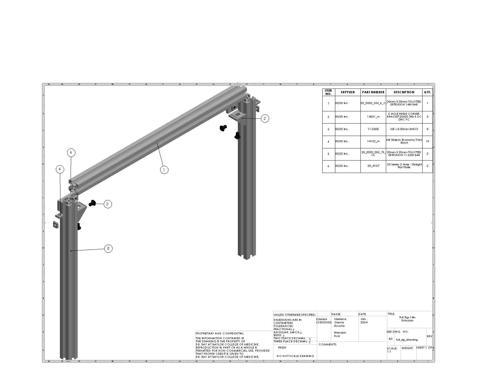
.. raw:: html 

   <video controls width="320" height="180">
      <source src="_static/1_Frame/4m_11_25_IN_Extrusion.mp4">
   </video>
 
5.  Connect the 28" extrusion to the top of the 14" extrusion using
    Inside Corner Brackets, creating a three-leg base as seen in the
    mechanical drawing.
..    
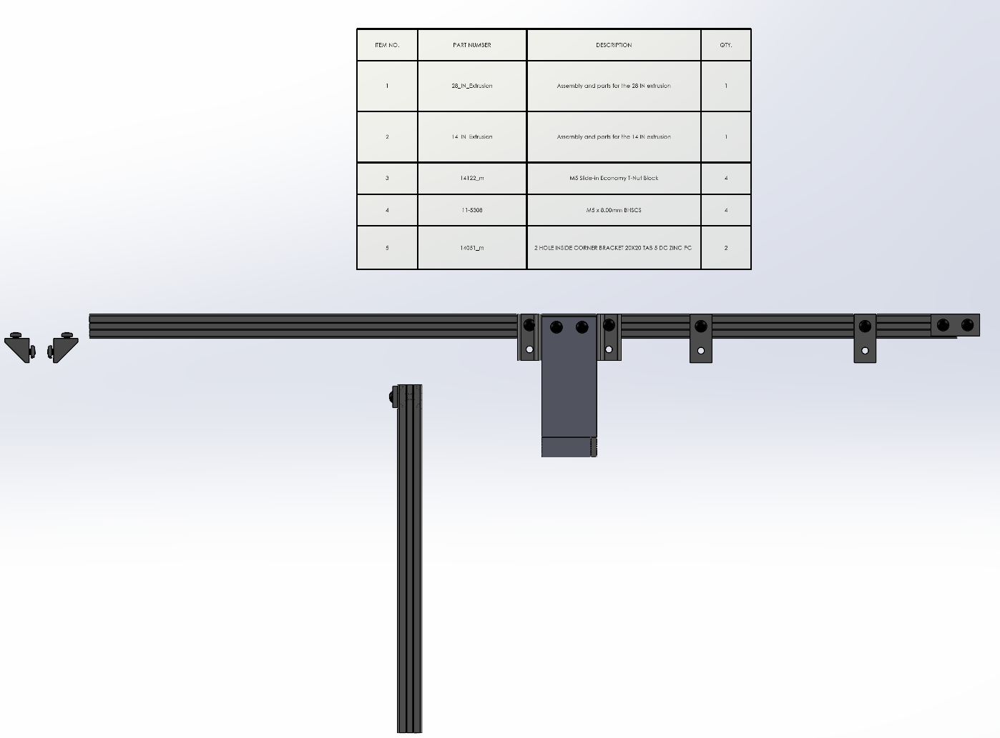

.. raw:: html 

   <video controls width="320" height="180">
      <source src="_static/1_Frame/6m_Full_Rig_1.mp4">
   </video>

6.  Connect the 12" extrusion to the right of the 28" extrusion (as seen
    in the mechanical drawing) using an Inside Corner Bracket.
..    
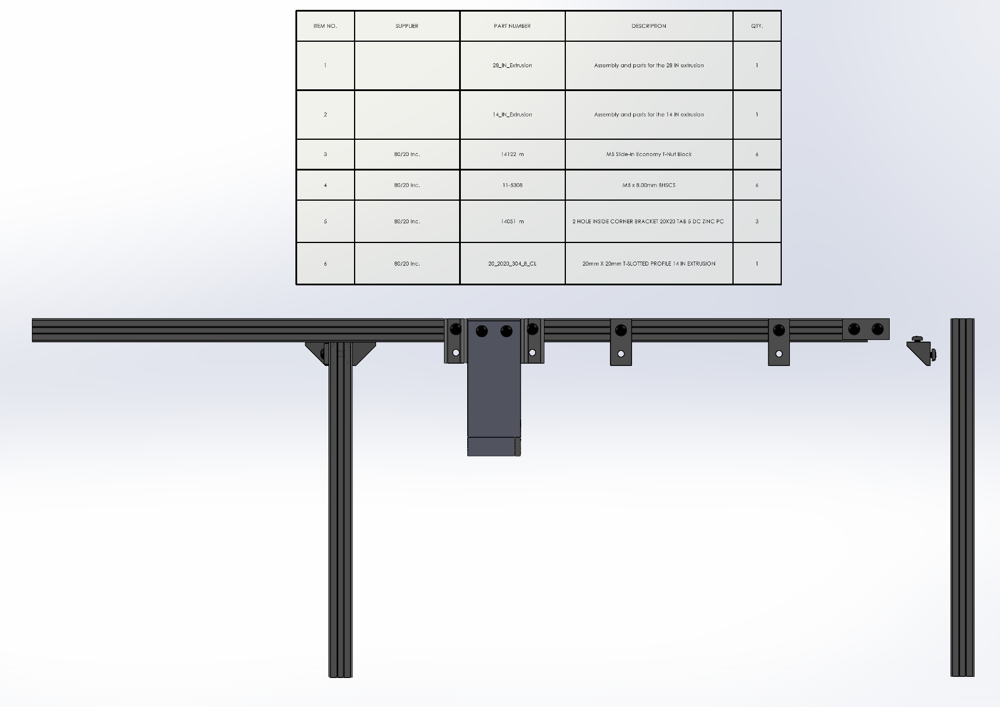

.. raw:: html 

   <video controls width="320" height="180">
      <source src="_static/1_Frame/6m_Full_Rig_2.mp4">
   </video>

7.  At each connection point between extrusions under where the 2-hole
    Flat Plates will be placed as seen in the mechanical drawing, file
    the non-conductive coating and apply copper tape to allow electrical
    connection between extrusions.

8.  Attach the 2-hole Flat Plates at connection points on the electrical
    tape to secure joints.

9.  Use a digital multimeter (DMM) to ensure all extrusions are
    electrically connected in one node.

10. Attach two Inside Corner Brackets to each leg, then drill holes on
    the cart surface to mount the frame using M5x12 Button Head
    Screws.\ 
    
**Stepper Motor Assembly:**
---------------------------

Below are the components needed to assemble the stepper motor that is a
part of the Looper system. The mechanical drawings below provide visuals
and dimensions for the components necessary for assembling the stepper
motor of Looper. You will need:

-  1 x 6" Linear Rail

-  2 x Stepper Motors

-  1 x Motor Mount Plate

-  1 x Wheel Plate

-  1 x Pulley Plate

-  1 x Pulley Kit

-  1 x Motor Mount

-  4 x M5 Slide-in T-Knut

-  4 x M5x10 Low Profile Screws

-  4 x M5x8 Button Head Screws

-  4 x M3x10 Button Head Screws

-  4 x M3x6 Button Head Screws

-  1 x GT2 36 Tooth 5mm Bore

-  21" GT2 Timing Belt

 ..  image:: Images/2_StepperMotor/1_motor_mount.PNG
   :width: 49%
 .. image:: Images/2_StepperMotor/motor_mount_drawing.PNG
   :width: 49% 

How to Assemble the Stepper Motor:

1.  Assemble the Wheel Plate as seen on the OpenBuilds websit (
    https://openbuildspartstore.com/mini-v-gantry-kit/). Make sure the
    eccentric spacers are on one side of the plate, and the normal
    spacers are on the other.

2.  Slide the Wheel Plate onto the 6" Linear Rail (double aluminum
    extrusion) in the correct orientation (as seen on the mechanical
    drawing); while the Wheel Plate is on the rail, adjust the eccentric
    spacers until the wheels tighten appropriately. Tighten just enough
    that the plate does not jiggle on the rail, but not so much that it
    will not roll freely. This will minimize friction and rattling
    during AGE operation.

3.  Assemble the Pulley Kit as seen on the OpenBuilds website
    (https://openbuildspartstore.com/smooth-idler-pulley-kit/). Attach
    the assembled kit onto the Pulley Plate.

4.  Attach the Pulley Plate to the left side of the Linear Rail, keeping
    the edge of the M5 T-Knut flush with the edge of the rail as shown
    in mechanical drawings. Ensure that the pulley wheel can rotate
    freely.

5.  Make sure the Wheel Plate is still on the rail, attach the Pulley
    Plate to the other side of the rail, and ensure that the M5 T-Knut
    is flush with the end of the rail.

6.  Ensure that all pieces have been fixed in the proper orientation.

7.  Using M3x6 screws, fix one Stepper Motor to the Motor Mount Plate.

8.  Attach the GT2 36 Tooth Bore onto the axle of the Stepper Motor,
    making sure it is flush with the tip.

9.  Cut approximately 21" of GT2 Timing Belt and thread it through one
    of the slits on the bottom right of the wheel plate. Fix it there
    using two zip ties.

10. Thread the GT2 track around the GT2 36 Tooth Bore on the motor axle,
    through the middle of the extrusion, around the pulley wheel, and
    back through the slit on the left side of the Wheel Plate. Pull it
    snug and fix using two zip ties. Remove any excess track.

11. Assess the range of motion of the Wheel Plate. It should glide
    freely on the rail.

12. Attach the 3D-printed Motor Mount to the bottom of the Wheel Plate
    using the four M5x10 Low Profile Screws. Attach the second stepper
    motor to the motor mount part with M3x10 Screws.

13. Attach the Stepper Motor Assembly to the 28" aluminum extrusion on
    the Frame at the location specified in the mechanical drawings.
    Secure in place using the two 2-hole Flat Plates hanging down, and
    ensure the rail is electrically connected to the Frame with copper
    tape.
..
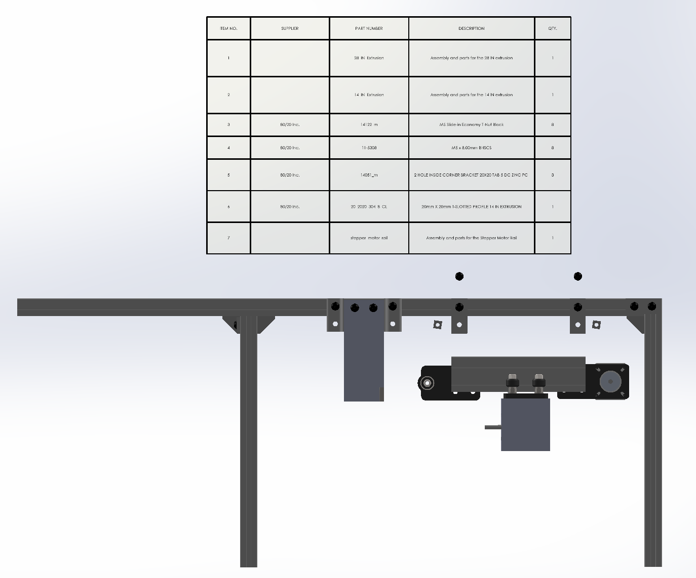
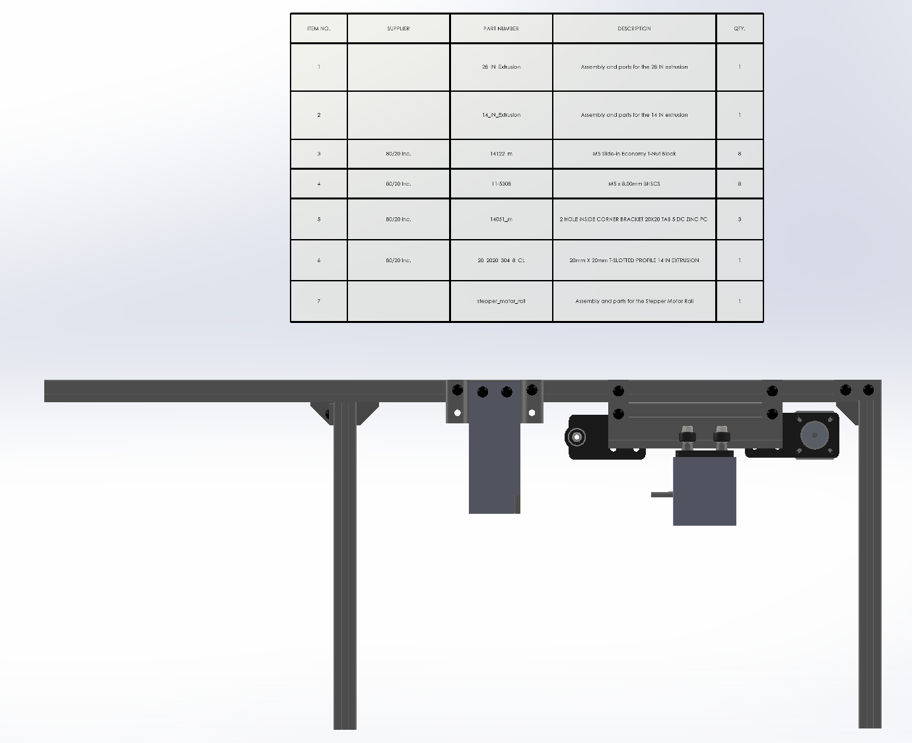
.. raw:: html 

   <video controls width="640" height="360">
      <source src="_static/2mFull_Rig_3.mp4">
   </video> 

**Syringe Holder Assembly**
---------------------------
..  image:: Images/3_SyringeHolder/1_1_syringe_holder_ex.png
   :width: 100% 
Below are the components needed to assemble the syringe holder that is a
part of the Looper system. The mechanical drawings below provide visuals
and dimensions for the components necessary for assembling the syringe
holder of Looper. You will need:

-  1 x 13" Hardened Rod

-  1 x Syringe Holder 1

-  1 x Syringe Holder 2

-  4 x Plastic Syringes

-  1 x Rod Coupling

 ..  image:: Images/3_SyringeHolder/2_syringe_holder1_v2_drawing.PNG
   :width: 49%
 .. image:: Images/3_SyringeHolder/3_syringe_holder2_v2_drawing.PNG
   :width: 49% 
..
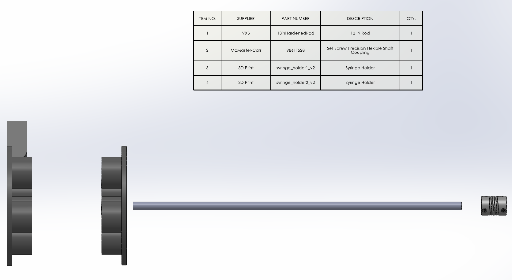
  
.. raw:: html

   <video controls width="320" height="180">
      <source src="_static/3_SyringeHolder/syringe_holder_assembly.mp4">
   </video> 
 
**How to Assemble the Syringe Holder:**

1. Push the 3D-printed Syringe Holder components onto the 13" Hardened
   Rod and secure them in place as seen in the mechanical drawing.

2. Slide the four Plastic Syringes into the holes in the Syringe
   Holders; it will be a tight fit.

3. Slide the right side of the 13" Hardened Rod through the Rod Holder
   on the Frame.

4. Slide the Rod Coupling on the right side of the 13" Hardened rod,
   then tighten down the Rod Coupling.

5. Slide the other side of the Rod Coupling onto the axle of the second
   Stepper Motor (the bottom motor of the Stepper Motor Assembly), then
   tighten down the other side of the Rod Coupling.

..  image:: Images/3Full_Rig_6.png
   :width: 100%  
**Valve Rack Assembly**
-----------------------
..  image:: Images/4_Valve_Rack/valve_rack.png
   :width: 100% 
Below are the components needed to assemble the valve rack that is a
part of the Looper system. The mechanical drawings below provide visuals
and dimensions for the components necessary for assembling the valve
rack of Looper. You will need:

-  1 x 4" Extrusion

-  4 x Valves

-  8 x Hose Fittings

-  8 x 6-32 1/4" Screws

-  1 x Valve Mount

-  7 x M5x8 Button Head Screws

-  7 x M5 Slide-in T-Knut

-  1 x Inside Corner Bracket

 ..  image:: Images/4_Valve_Rack/2_valve_mount_drawing.PNG
   :width: 49%
 .. image:: Images/4_Valve_Rack/1_valve_rack_ex.PNG
   :width: 49% 

**How to Assemble the Valve Rack:**

1. Screw the Hose Fittings into both sides of each valve.

2. Screw the Valves onto the Valve Mount with 6-32 1/4" Screws. Ensure
   in/out airports are on the correct side.

3. Screw the Valve Mount onto the 4" Extrusion with M5 Screws and
   T-Nuts.

4. Attach the assembly onto the 28" extrusion of the Frame as seen in
   the mechanical drawing.
..
.. raw:: html

   <video controls width="640" height="360">
      <source src="_static/4_Valve_Rack/valve_rack.mp4">
   </video> 
..  image:: Images/4Full_Rig_7.png
   :width: 100%  
**Mouse Holder Platform Assembly**
----------------------------------
..  image:: Images/5_MouseHolder/1_1_mouse_holder_assembly.png
   :width: 100% 

Below are the components needed to assemble the mouse holder platform
that is a part of the Looper system. The mechanical drawings below
provide visuals and dimensions for the components necessary for
assembling the mouse holder platform of Looper. You will need:

-  2 x 5" extrusions

-  3 x Inside Corner Bracket

-  2 x M5x12 Socket Head Screws

-  8 x M5x8 Button Head Screws

-  10 x M5 Slide-in T-Knuts

-  1 x Mouse Holder Component 1

-  1 x Mouse Holder Component 2

-  1 x Mouse Holder Component 3

-  1 x Mouse Holder Component 4

-  1 x Rod Support

..  image:: Images/5_MouseHolder/mouseholder1_drawing.png
   :width: 19% 
..  image:: Images/5_MouseHolder/mouseholder2_drawing.png
   :width: 19% 
..  image:: Images/5_MouseHolder/mouseholder3_drawing.png
   :width: 19% 
..  image:: Images/5_MouseHolder/mouseholder4_drawing.png
   :width: 19% 
..  image:: Images/5_MouseHolder/rod_support_drawing.png
   :width: 19% 
**How to Assemble the Mouse Holder Platform:**

1. Attach the two 5" extrusions at a right angle, as specified by
   mechanical drawings. Secure the joint with an Inside Corner Bracket.

2. Attach 3D-printed Mouse Holder Components 2 and 3 to the vertical
   extrusion (as shown in mechanical drawings above).

3. Using M5x12 Socket Head Screws, secure Mouse Holder Component 1 to
   the horizontal aluminum extrusion (as specified in mechanical
   drawings above).

4. Slide the 3D-printed Rod Support into the Mouse Holder Component 2,
   then slide the Mouse Holder Component 4 onto the Rod Support.

5. Adjust the placement of the Mouse Holder Components so that Mouse
   Holder 4 is concentric with Mouse Holder 1.

6. Attach the assembly to the top of the 28" extrusion of the Frame with
   two Inside Corner Brackets, close to its junction with the 14"
   extrusion. Check mechanical drawings above for precise locations.
..
..  image:: Images/5_MouseHolder/1_mouse_holder_assembly_ex.png
   :width: 49% 
..  image:: Images/5_MouseHolder/2_mouse_holder_assembly.png
   :width: 49% 
.. image:: Images/5Full_Rig_8.png
   :width: 100%
**Pipette Calibrator Assembly**
-------------------------------
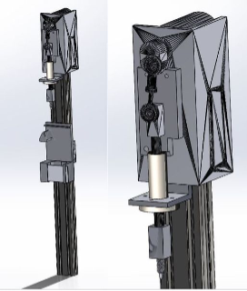
Below are the components needed to assemble the pipette calibrator that
is a part of the Looper system. The mechanical drawings below provide
visuals and dimensions for the components necessary for assembling the
pipette calibrator of Looper. You will need:

-  1 x Linear Actuator Assembly

-  1 x 20mm x hofitti40mm Double Extrusion (16 in)

-  1 x Linear Bearing

-  1 x Bearing Stand

-  2 x M5x12 Button Head Screws

-  4 x M5x8 Button Head Screws

-  2 x M5 Washers

-  4 x M4x16 Screws

-  4 x M4 Nuts

-  2 x M3x16 Screws

-  4 x M3x8 Hex Socket Screws

-  6 x M3 Nuts

-  1 x Actuator Glide

-  1" Aluminum Bar

-  1 x Spring Plunger

-  1 x Pipette Holder

-  1 x Pipette Holder Door

-  1 x 20 uL Pipette

-  2 x Inside Corner Brackets

..  image:: Images/6_PippetteCalibrator/full_pipette_holder_drawings.png
   :width: 19% 
..  image:: Images/6_PippetteCalibrator/pipette_holder_door_drawing.png
   :width: 19% 
..  image:: Images/6_PippetteCalibrator/pipette_holder_drawing.png
   :width: 19% 
..  image:: Images/6_PippetteCalibrator/pipette_rod_holder_drawing.png
   :width: 19% 
..  image:: Images/6_PippetteCalibrator/pipette_rod_slider_drawing.png
   :width: 19% 

**How to Assemble the Pipette Calibrator:**

1.  On the face with four large holes of the Linear Actuator Assembly,
    use the drill press to drill the two holes closest to the other face
    and pull the opening to the left towards the other face.

2.  Push the Linear Bearing through the 3D printed Bearing Stand, then
    screw down with the four M3x8 Hex Socket Screws and M3 Nuts.

3.  On the Linear Actuator Assembly, unscrew and remove the rectangular
    prism at the end of the actuator rod. Then, unscrew and remove the
    original attached linear bearing.

4.  Slide the actuator rod through the Linear Bearing, then screw in the
    Bearing Stand where the original linear bearing once was with three
    M4x16 screws and M4 Nuts.

5.  Slide the Actuator Glide under the rectangular prism at the top of
    the actuator rod, then screw in with one M4x16 Screw and M4 Nut at
    the bottom and two M3x16 Screws and M3 Nuts at the top.

6.  On the 1" Aluminum Bar, drill 15/64 lengthwise all the way through.
    Then using the same hole, drill 7mm halfway through. On "-28. On the
    half with the larger hole, tap with 8mm-1.0.

7.  Screw the 1" Aluminum Bar onto the actuator rod, then screw the
    Spring Plunger onto the 1" Aluminum Bar.

8.  Attach what has been assembled so far to the top of the Double
    Extrusion with M5x12 Hex Socket Screws, as seen in the mechanical
    drawing. Use M5 Washers if needed.

9.  Slide the Pipette Holder onto the Double Extrusion as seen in the
    mechanical drawings and screw in place.

10. Place the 20 uL Pipette into the Pipette Holder and secure it with
    the Pipette Holder Door. Adjust the Pipette Holder so that the
    Pipette is pressed with the full range of motion of the Linear
    Actuator.

11. Attach the assembly to the far leg of the Frame with two Inside
    Corner Brackets.
..
.. image:: Images/6full_rig_22.png
   :width: 100%
**Switch Sensor Assembly**
--------------------------
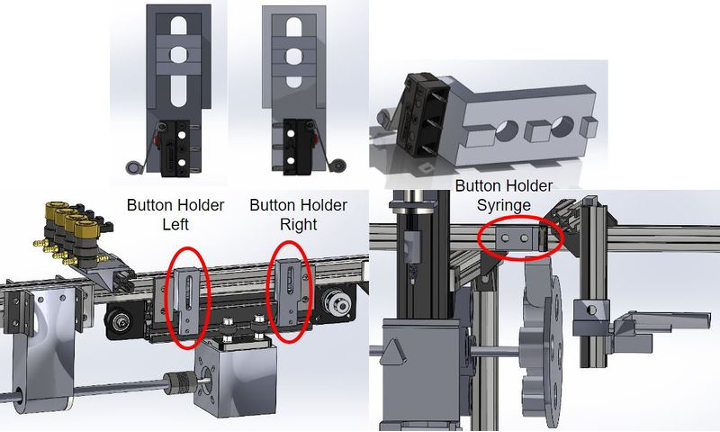
Below are the components needed to assemble the switch sensors that are
a part of the Looper system. The mechanical drawings below provide
visuals and dimensions for the components necessary for assembling the
switch sensors of Looper. You will need:

-  3 x Switch Sensors

-  1 x Button Holder Left

-  1 x Button Holder Right

-  2 x Button Screw Holders

-  1 x Button Holder Syringe

-  2 x M5x20 Socket Head Screws

-  2 x M5x8 Button Head Screws

-  4 x M5 Slide-in T-Knut

-  2 x M5 Washers

-  6 x M2x14 Button Head Screws

-  6 x M2 Nuts

..  image:: Images/7_Button_Holder/4_buttonholder_left_drawing.png
   :width: 24% 
..  image:: Images/7_Button_Holder/5_buttonholder_right_drawing.png
   :width: 24% 
..  image:: Images/7_Button_Holder/buttonholder_screw_drawing.png
   :width: 24% 
..  image:: Images/7_Button_Holder/buttonholder_syringe_drawing.png
   :width: 24% 

**How to Assemble the Switch Sensors:**

1. Attach Switch Sensors to the back of both Button Holder Left and
   Button Holder Right with two M2x14 Screws and M2 Nuts each. Attach
   the third Switch Sensor to the outside of the Button Holder Syringe
   (as seen in the mechanical drawings above).

2. Slide in the Button Screw Holders behind the Button Holder Left and
   Button Holder Right.
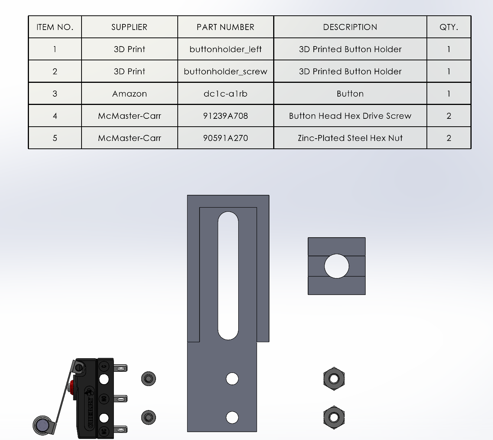
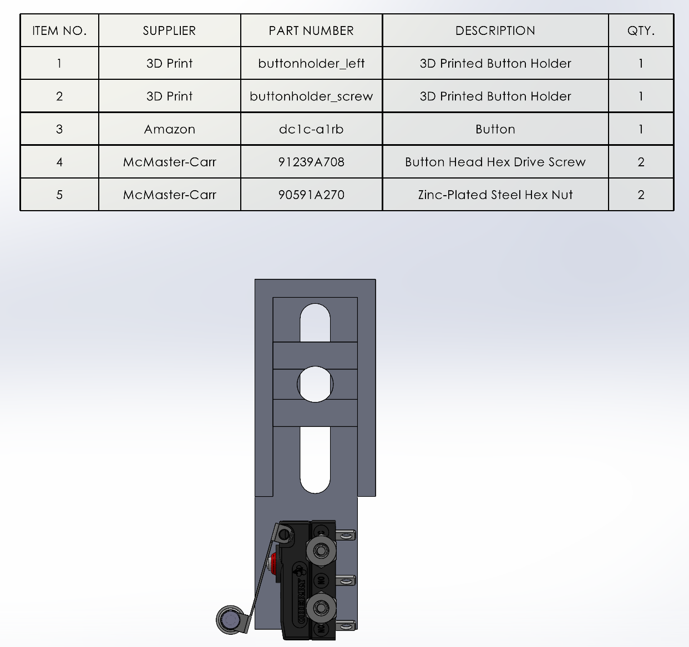
3. Attach Left and Right Button Holders to the Frame on both sides of
   the Stepper Motor Rail with M5x20 Socket Head Screws and M5 Washers
   (as seen in the mechanical drawing above).
..  image:: Images/7Full_Rig_4_ex.png
   :width: 49% 
  
.. raw:: html

   <video controls width="320" height="180">
      <source src="_static/7mFull_Rig_4.mp4">
   </video> 
 
4. Attach the Button Holder Syringe to the Frame near the Syringe
   Holders with M5x8 Button Head Screws.
..  image:: Images/7_Button_Holder/6_buttonholder_syringe_assembly_ex.png
   :width: 49% 
..  image:: Images/7_Button_Holder/7_buttonholder_syringe_assembly.png
   :width: 49% 
5. Adjust all three switch buttons so they are all in the correct place
   on the Frame.

**Waterbath Holder and ECG Holder Assembly**
---------------------------------------------
**Please go to Acrylic Section for waterbath construction**

..  image:: Images/8_Water_Bath_Holder/1_Water_Chamber_and_ECG_Holder_Assembly_ex.png
   :width: 49% 
..  image:: Images/8_Water_Bath_Holder/2_Water_Chamber_and_ECG_Holder_Assembly.png
   :width: 49% 
.. raw:: html

   <video controls width="640" height="360">
      <source src="_static/8_Water_Bath_Holder/Water_Chamber_and_ECG_Holder_Assembly.mp4">
   </video> 
 
Below are the components needed to assemble the water bath holder and
ECG holder that is a part of the Looper system. The mechanical drawings
below provide visuals and dimensions for the components necessary for
assembling the water bath holder and ECG holder of Looper. You will
need:

- 1x ECG Holder
- 1x Water Jacket Holder
- 1x Water Chamber
- 3x M4x8 Screws
- 3x M4 Nuts
- 1x M5x40 Screw
- 1x M5 Nut
- 1x Water Chamber

**How to Assemble the Water Bath Holder and ECG Holder:**

- **Attach the ECG Holder:** Slide the ECG Holder onto the extrusion, ensuring it is properly positioned.
- **Align the Water Jacket Holder:** Align the slots on the Water Jacket Holder with the corresponding holes on the ECG Holder.
- **Secure with M4 Screws:** Use M4x8 screws and corresponding M4 nuts to secure the ECG Holder and Water Jacket Holder together through the aligned slots and holes. Tighten securely.
- **Position the Water Chamber:** Align the hole at the top of the Water Chamber with the bottom of the Water Jacket Holder.
- **Secure the Water Chamber:** Use an M5x40 screw and an M5 nut to secure the Water Chamber in place, ensuring a firm connection.

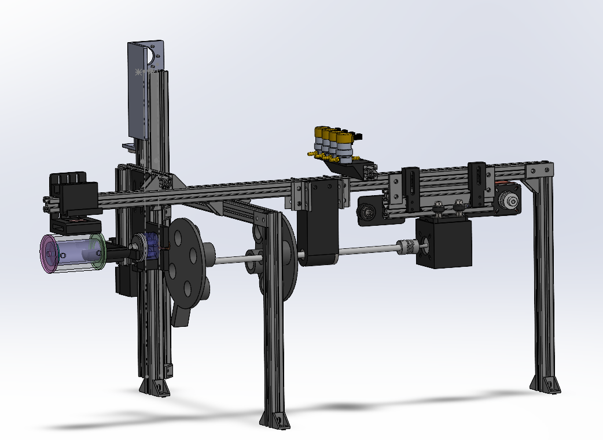

ACRYLIC COMPONENTS
==================

**Facemask Assembly**
---------------------

Below are the components needed to assemble the face mask that is a part
of the Looper system. The mechanical drawings below provide visuals and
dimensions for the components necessary for assembling the face mask of
Looper. You will need:

-  Acrylic Tubing, OD: ½’’ ID: ¼’’

-  45-degree router bit

-  Gasket - Durameter Rating of 10A; 1/32’’ thickness, 1mm; 3M 300LSE
   backing

-  Flat Acrylic piece - 2mm thick

-  Groz v-block

-  PPCS Weld-On 4 Acrylic Adhesive - 4 Oz and Weld-On

..  image:: Images/9_Facemask/Facemask_FrontFace_Drawing.png
   :width: 32% 
..  image:: Images/9_Facemask/Facemask_Snorkel_Drawing.png
   :width: 32% 
..  image:: Images/9_Facemask/Full_Facemask_Drawing.png
   :width: 32% 

**How to Build and Assemble the Facemask:**

1.  Measure and Cut Acrylic Tubing:

    a. Measure and cut a piece of acrylic tubing to a length of 18mm.

2.  Deface Side with Less Chipping/Imperfections:

    a. Use the file 'tiny tube first side deface' to deface the side of
       the tubing with fewer imperfections.

    b. Iterate until the edge is completely perfect around the edges.

3.  Deface the Other Side to 15mm:

    a. Use file 'tall tiny tube to 15 mm' to deface the other side of
       the tubing down to 15mm.

4.  Pecking:

    a. Use the file 'hole pecking for facemask tube' to perform pecking
       on the acrylic tubing.

5.  CNC Mill Setup:

    a. Use a 3/8’’ end mill in a collet for defacing.

    b. Use a 45-degree router bit in a 1/4" American collet for pecking.

    c. Ensure the router bit is sharp to prevent acrylic shattering
       during drilling.

6.  Defacing Procedure:

    a. Use the small Groz v-block to clamp the tubing.

    b. Set zero as the center of the tube at its top face height.

7.  Pecking Procedure:

    a. Use the small Groz v-block to clamp the tubing, adjusting the
       height to 9mm between the bar and the top face of the Groz
       v-block.

    b. Zero the z-axis to the surface of the Groz v-block and x, y to
       the top right corner of the Groz v-block at the transition
       between the top face and bevel.

8.  Secondary Defacing:

    a. After initial defacing and pecking, deface the side again to make
       the tubing 10mm tall using file 'tiny tube 10mm deface'.

    b. Set x0 and y0 as the center of the tube, and z0 as the top
       surface of the Groz v-block.

9.  Execution and Safety Measures:

    a. Execute the files.

    b. Wear goggles during the process to prevent eye injury from
       chipping.

    c. Finished piece: |A person holding a small plastic object
       Description automatically generated|

10. Cutting Square Acrylic Piece:

    a. Cut the square acrylic piece into a 1 and ½’’ circle.

11. Drilling Hole in Acrylic Piece:

    a. Use the Praxxon drill with ¼’’ drill bit to drill a hole in the
       center of the flat acrylic piece.

    b. Place a scratch piece of acrylic below the drilling piece to
       avoid damaging the bit.

    c. Peck at the flat acrylic piece rather than drilling straight
       through.

12. Assembly:

    a. Place a small piece of aluminum (¼’’ diameter) in the drilled
       flat acrylic piece.

    b. Apply acrylic adhesive #4 to the cylindrical acrylic piece using a 1
       mL syringe and green needle.

    c. Carefully apply the circular piece to the flat acrylic piece.

    d. Apply a metal block to apply pressure and leave it to set overnight.

13. Finalization:

    a. Apply the gasket and punch a hole in the gasket that lines up
       with the opening on the acrylic piece.

**Pneumotachograph**
--------------------

Below are instructions on how to assemble the pneumotachograph that is a
part of the Looper system. The mechanical drawings below provide visuals
and dimensions for the components necessary for assembling the main
pneumotachograph of Looper. You will need:

-  Clear Scratch and UV-Resistant Acrylic Round Tube, 1/8" Wall
   Thickness, 1/2" OD, 1/4" ID, 6 Feet Long

-  Flat Acrylic piece - 2mm thick (2”x 2” square?)

-  Clear Scratch- and UV-Resistant Cast Acrylic Rod, 1-1/2" Diameter

-  3/8’’ endmill

-  Sherline 1012 Sherline Sensitive drilling attachment

-  ¼’’ drilling bit

-  ¼’’ Collet

-  1/32’’ drilling bit

-  Groz Stainless Steel Engineers' Square

-  PPCS Weld-On 4 Acrylic Adhesive - 4 Oz and Weld-On

..  image:: Images/10_Pneumotach/Pneumotachograph_FrontFace_Drawings.png
   :width: 24% 
..  image:: Images/10_Pneumotach/Pneumotachograph_MainBody_Drawings.png
   :width: 24% 
..  image:: Images/10_Pneumotach/Pneumotachograph_Snorkel_Drawing.png
   :width: 24% 
..  image:: Images/10_Pneumotach/Full_Pneumotachograph_Drawing.png
   :width: 24% 

**Code Used for the CNC Mills and Guiding Files:**

The files to aid in creating the appropriate pieces necessary for
building the pneumotachograph are saved onto the CNC Mills Computer. The
files themselves contain additional guiding information. Below outlines
where to locate the files:

-  Configuration: /home/sherline/emc2/configs/Sherline4Axis ==> all of
   the files will be in this location

**Below are guiding file information:**

   **Cylinder Defacing:**

   1. ‘1st side deface w subroutine’

   2. ‘2nd side deface w subroutine’

   **Hole Tapping with 1/32” Bit:**

   -  Center Hole

      -  ‘center hole tap’

      -  ‘center hole tap long’

   -  Side Holes

      -  ‘center hole tap’

      -  ‘side hole tap long’

   -  Hole 7mm From Edge

      -  ‘center hole tap’

      -  ‘not quite to center’

   -  Hole Connecting to 7mm From Edge Hole:

      -  ‘tap to 7mm hole’

   **4 Equally Spaced Holes With 1/4” Bit**

   1. ‘4 equally spaced holes’

   1. Defacing of Side Hole

   1. ‘square deface’

   2. Defacing of ½” OD, ¼” ID tubes

   1. ‘tiny tube first side deface’

   2. ‘tiny tube second side deface’

**How to Build and Assemble the Pneumotachograph:**

   1. Defacing:

      a. Cut the acrylic rod to a length of 28.5mm.

      b. Square the cylinder to the Groz to ensure the face will be defaced
         level.

      c. Verify alignment using a square edge.

      d. Ensure the cylinder is tight enough in the Groz, which is
         tightened into the clamp held by two L-shaped metal pieces onto
         the CNC mill.

   ..

      |A machine with a blue tube on it Description automatically
      generated|

   2. 1/32" Tapping:

      a. Find the center of the cylinder using the center square.

      b. Draw intersecting lines on the face to locate the center.

      c. Use a long 1/32” bit only for tapping the center hole.

      d. For other tapping steps, use a short bit with about 10 mm exposed.

      e. Ensure the cylinder is centered over the gap in the clamp to avoid
         drilling into the metal.

      f. Adjust the airflow to blow chips effectively without misaligning
         the bit.

      g. Monitor the tapping process to clear chips and prevent melting.

      h. Replace the bit when the black coating wears off to reduce chip
         buildup.

   3. Side Holes:

      a. Align the cylinder on the mill.

      b. Place a long bit through the center hole and align the short bit
         in the chuck perpendicular to the long bit.

      c. Zero the X axis.

      d. Ensure the center hole and clamp are not slanted for accurate
         alignment of side holes.

      e. Tap the first hole about 8-10 mm from the front face to
         accommodate automatic movement for the second hole.

   4. 7 mm Side Hole:

      a. Tap the 7 mm hole 90 degrees counterclockwise from the side holes.

      b. Define the front face of the cylinder.

      c. Use a caliper to score the cylinder 7 mm from the front face where
         the hole will be tapped.

      d. Mark the location of the end of the 7 mm hole with a pen while
         holding the cylinder to align the hole from the front face.

   5. Magnets:

      a. Once the four ¼” equally spaced holes are tapped through the front
         face, place ten small magnets in each hole.

      b. Ensure all magnets are level with the acrylic surface.

      c. Use a rubber mallet to pound down if needed.

      d. Orient each stack of ten magnets in the same direction.

   6. Gluing Steps

      a. Preparation and Safety Measures:

         i.   Ensure to use a syringe for applying acrylic cement.

         ii.  Recap the syringe when not in use and keep it within sight.

         iii. Dispose of used needles and syringe tubes properly.

         iv.  Consider using a new syringe if gluing over a longer period
            to prevent melting the rubber plunger.

      b. Acrylic Sheet to Front Face:

         i.    Place a 1/32” bit in each tapped hole to prevent cement from
               entering.

         ii.   Cut a square piece of ⅛” acrylic sheet with a 1/4" hole in
               the center.

         iii.  Clean both surfaces.

         iv.   Apply #4 acrylic cement using a 1mL syringe and green
               needle.

         v.    Apply cement to both faces, align the sheet, and press down.

         vi.   Apply cement around the hole's inner and outer edges.

         vii.  Place a weight over the sheet.

         viii. Check alignment and adjust if necessary.

         ix.   Allow it to set for at least 24 hours.

         x.    Use a Dremel to make the sheet flush with the cylinder.

      c. Side Hole Air Gasket:

         i.   Place a 1/32” bit in the side hole to prevent glue from
            entering.

         ii.  Use #16 acrylic glue to adhere small air gaskets with punched
            holes to the defaced surface.

         iii. Apply glue along the rim of the air gasket base and press
            down.

         iv.  Place a weight over the gaskets.

         v.   Use vice grips and a twisting motion to remove the bits if
            necessary.

         vi.  Allow it to set for 24 hours.

      d. Tiny Tube Defacing:

         i.  Deface tiny tubes using a similar Groz and clamp setup.

         ii. Aim for tubes about 15 mm tall after defacing both sides.

      e. Back Face Cylinder:

         i.   Place a bit in the center hole of the tiny tubes.

         ii.  Apply #4 cement on one edge of the tiny tubes using a 1mL
            syringe and green needle.

         iii. Place the tubes on the back face of the cylinder, align, and
            press down.

         iv.  Apply additional cement around the outer edge of the tubes.

         v.   Place a weight on top of the tubes.

         vi.  Allow it to set for at least 24 hours.

   7. Final Product:
       ..  image:: Images/10_Pneumotach/Built_Pneumotach.png
        :width: 50% 

**Water Bath Assembly**
-----------------------

Below are instructions on how to assemble the water bath that is a part
of the Looper system. The mechanical drawings below provide visuals and
dimensions for the components necessary for assembling the water bath of
Looper. You will need:

**Equipment:**
   - CNC Mill
   - Drill Press
   - Hand Router 
   - 1/4" Drill Bit (Round Head) 
   - 15/64" Drill Bit (Round Head)
   - 1/4"-20 Tap
   - 1/4"-28 Tap
   - Concentric Hold (3D printed)
   - Steady End (3D printed from Sherline Steady End design)
   - Dremel
   - Table Saw
   - Soapy Water
   - Metal Clippers

**Materials:**
   - 1" ID, 1/8" thick wall acrylic pipe (one piece)
   - 1.75" ID, 1/8" thick wall acrylic pipe (one piece)
   - Female Iver to thread (two pieces)
   - #4 Acrylic Adhesive
   - #40 Acrylic Adhesive
   - #16 Acrylic Adhesive
   - 1/8" thick acrylic sheet
   - 1"x1"x~0.5" thick acrylic block (one piece)
   - 1/4"-20 plastic screws (two pieces)
..

..  image:: Images/11_WaterBath/base_0.25in_hole_drawing.png
   :width: 16% 
..  image:: Images/11_WaterBath/base_1in_hole_drawing.png
   :width: 16% 
..  image:: Images/11_WaterBath/big_tube_drawing.png
   :width: 16% 
..  image:: Images/11_WaterBath/block_drawing.png
   :width: 16% 
..  image:: Images/11_WaterBath/small_tube_base_drawing.png
   :width: 16% 
..  image:: Images/11_WaterBath/small_tube_drawing.png
   :width: 16% 
..  image:: Images/11_WaterBath/Water_Chamber_Full_Drawings.png
   :width: 100%       
..
**Procedure:**
   1. **Cut Acrylic Pipes**
      - Cut both pipes slightly longer than the desired chamber length:
         - Outer pipe: Initial length ~72–73 mm
         - Inner pipe: Initial length ~70–71 mm
      - Final chamber lengths:
         - Outer chamber: 2.75" (including face)
         - Inner chamber: 2.5" (including face)
   2.	**Flatten Ends**
      - Use the CNC Mill to flatten and square one end of each pipe.
      - Use the files saved on the Sherline 4-axis CNC under:
         - "large tube edge smooth"
         - "small tube edge smooth"
         - "concentric tube smooth"
   3.	**Create Base**
      - Glue each pipe to an acrylic sheet using #4 Acrylic Adhesive to create a closed base.
   4.	**Trim and Attach Back Plate**
      - Use a router to trim excess acrylic from the smaller pipe.
      - Cut a rectangle from the 1/8" acrylic sheet to fit inside the smaller pipe base.
      - Glue the rectangle to the smaller pipe using #4 Acrylic Adhesive.
   5.	**Assemble Concentric Pipes**
      - Glue the smaller pipe's base to the larger pipe's base using #16 Acrylic Adhesive.
      - Use the concentric hold to align and stabilize the pipes while the adhesive dries.
   6.	**Drill Holes in Pipes**
      - Use the drill press to create:
         - One 15/64" hole through the bottom of the concentric pipes.
         - Two 15/64" holes on opposite sides of the larger pipe (do not penetrate the inner pipe).
         - One 1/4" diameter hole in the 1"x1"x~0.5" acrylic block.
         - Two 15/64" diameter holes in the block leading to the 1/4" hole.
   7.	**Tap Holes**
      - Use the 1/4"-20 Tap with soapy water to tap the two holes in the acrylic block.
      - Use the 1/4"-28 Tap to tap the two holes in the concentric acrylic pipes.
   8.	**Glue Ivers and Screws**
      - Glue the Female Ivers into the threaded holes in the pipes using #4 Acrylic Adhesive.
      - Cut 1/4"-20 plastic screws to ~0.8" length using metal clippers and a Dremel.
   9.	**Final Sealing**
      - Use #40 Acrylic Adhesive to glue the inner pipe to a 1/8" acrylic sheet.
      - Glue the larger pipe to the same sheet using #4 Acrylic Adhesive.
   10. **Trim and Finish**
      - Use a router and Dremel to trim the acrylic sheet, ensuring a smooth finish.
      - Create an opening in the smaller pipe by cutting through the top acrylic sheet.
      - Ensure all edges are flush and clean for final use.

**Notes:**
   - Always wear appropriate safety gear when using tools.
   - Allow adhesives to dry fully before prceeding to the next step.
..

ELECTRICAL COMPONENTS
=====================

**Main Electronics Box**
------------------------

Below are instructions on how to assemble the main electronics box that
is a part of the Looper system. The mechanical drawings below provide
visuals and dimensions for the components necessary for assembling the
main electronics box of Looper.

..  image:: Images/12_MainElectricBox/arduino_holder_drawing1.png
   :width: 24% 
..  image:: Images/12_MainElectricBox/arduino_holder_drawing2.png
   :width: 24% 
..  image:: Images/12_MainElectricBox/arduino_holder_drawing3.png
   :width: 24% 
..  image:: Images/12_MainElectricBox/arduino_MEGA_bumper_drawing.png
   :width: 24% 
..  image:: Images/12_MainElectricBox/Ebox_Assembly_drawing.png
   :width: 100% 

How to Assemble the Main Electronic Box:

1. Print the Arduino Holder at 35% infill with support everywhere.

   c. Print with a brim. After the brim has printed tape down the brim
      to the printer base Because the Arduino Holder is such a large
      piece it will leave up easily from the printer base.

   d. After the print has been completed take off the supports. If the
      supports are stuck onto the Arduino Holder DO NOT PULL. This could
      cause the piece to break. Cut the sides of the supports with a
      clipper and slowly push them out.

2. Place 2 stepper motor drivers, Arduino Mega, and corresponding
   Arduino Shield into the Arduino Holder.

   c. The stepper motor drives are tight when put into the Arduino
      Holder, you must push the Arduino Holder legs apart for it to fit.

3. Slide the 12V power supply box into the bottom cavity of the
   3D-printed Arduino holder.

   c. Screw in two M4X16 HEX screws on either side of the Arduino Holder
      and crew in two M4X8 HEX screws on the base of the Arduino Holder
      to secure the power supply box.

   d. The Arduino Shield Bumper sits on top of the stepper motors.

4. Connect the power supply to stepper motor drivers and switch as
   specified in circuit diagrams.

   c. When connecting wires onto the module plug use Glarks 22-16 Gauge
      **Fully Insulated**. The Glarks connected to the 12-volt power
      supply are Ring Tongue Terminals, M4, 22-16 AWG.

5. Cut wires at lengths needed to reach from stepper motor drivers to
   the PCB. Crimp one end of each wire and insert it into the 6-pin
   female connector.

   c. When crimping makes sure that there is no wire exposed. It is best
      to crimp a piece of the wire covering instead of only the wire. If
      you crimp a small piece of covering, there is a smaller chance of
      having wire exposed and the connector is more stable. This also
      helps in the reduction of noise.

6. Expose opposite ends of the wires and apply some solder to the bare
   metal. This will help keep the wires in place in the stepper motor
   drivers.

   c. DO NOT expose too much of the wires. The part of the wire that is
      not in the stepper motor must be fully covered. Having them
      exposed is a safety hazard and adds to the overall noise.

7. Tighten wires into the stepper motor drivers.

8. Repeat steps for all wires coming out of the stepper motor drivers.

9. Apply the E-box cover to the Arduino Holder before powering on the
   device. This maximizes safety and minimizes the risk of damaging the
   electrical components.

**PCB Assembly**
----------------

Below are the instructions to assemble the PCB that is a part of the
Looper system. The mechanical drawings below provide visuals and
dimensions for the components necessary for assembling the PCB of
Looper. You will need:

-  Geebat Connector Kit

   -  2 of 1 x 2pin male header

   -  4 of 1 x 4pin male header

   -  2 of 1 x 6pin male header

-  3 of 1K Ohm Resistors

-  1 of 2 x 18pin female double row straight pin header strip

-  Pin Header Connectors

   -  1 of 1 x 8pin long needle Arduino stackable header

   -  2 of 1 x 10pin long needle Arduino stackable header

   -  1 of 2 x 3pin short needle Arduino stackable header

-  Breakable Pin Header

   -  1 of red single-row male header

   -  1 of green single-row male header

-  5 of Transistors:

   -  https://www.amazon.com/BOJACK-Epitaxial-Transistor-Darlington-Transistors/dp/B08BFYYK7D/ref=sr_1_3?crid=3AE53SRDQL3FX&keywords=tip120+transistor+bojack+20+pcs&qid=1654194523&s=industrial&sprefix=tip120+transistor+bojack+20+pcs%2Cindustrial%2C68&sr=1-3

-  Red and black Sharpie

-  1 of PCB

-  Soldering Station

-  Rosin Core Solder Wire

-  Flux

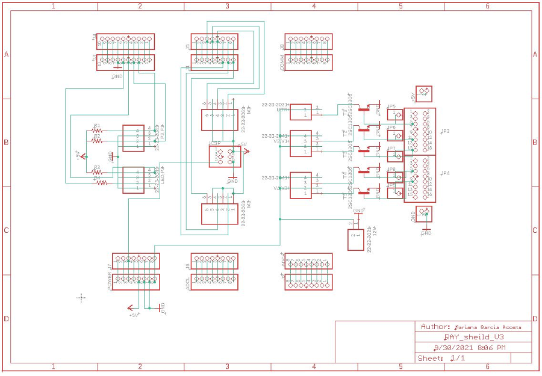
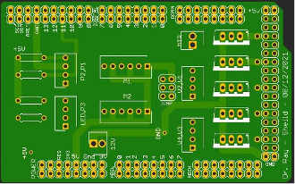
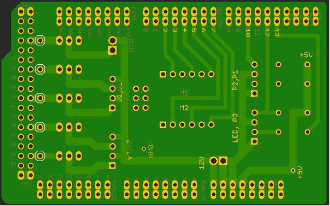

**How to Assemble the PCB:**

Flux must be added in small quantities to each hole on the pcb as you go
along. If it is accidentally spilled water can be used to clean it off
nonelectrical surfaces. If spilled over an electrical surface such as
the pcb use a paper towel wipe with a small amount of rubbing alcohol
and wipe it off.

1.  Solder on the 3 resistors, then cut off the extra wire.

2.  Solder on the 2 x 3pin short needle header with the pins facing the
    top of the pcb.

3.  Solder on the 2 x 18pin female header.

    i. Solder on the corners first so that your pin does not move from
       its position. Make sure that it is flush against the pcb.

4.  Solder on the 1 x 8pin long needle header and the 1 x 10pin long
    needle header on the left side of the pcb.

5.  Solder on the 12 V 1 x 2pin male header. Using your thumb or a
    tweezer hold the header flush against the pcb and straight.

6.  Solder on the 1 x 8pin long needle header on the left side of the
    pcb.

7.  Solder on the green and red single row male headers to the +5V and
    ground holes respectively onto the pcb.

8.  Solder on P1,P2 and P3,LED 1 x 4pin male headers.

9.  Solder on the M1 and M2 1 x 6pin male headers.

10. Solder on V1,V2 and V3,V4 1 x 4pin male headers.

11. Solder on the MMTR 1 x 2pin male headers.

12. Solder on 5 transistors.

**Assembly of Components for ECG Recording** 
---------------------------------------------

How to Assemble the Switch Sensors:

1. Slide the 3D-printed ECG Holder component onto the 28" aluminum
   extrusion. Secure large end of ECG Cable to the ECG Holder using zip
   ties.

2. Connect the ECG Cable to the amplifier and plug in the amplifier
   power cable.

3. To create electrodes, cut the desired length of thin electrode wire
   and strip ends using a fingernail.

4. Attach one end of the wire to the electrode holders using solder.
   Plug the three holders into the ECG cable.

5. When ready for animal tests, attach ECG electrodes to the animal
   using conductive paste and glue.

6. Modify bandpass filter cutoff frequencies as needed (typically, 100Hz
   for low-pass and 0.1Hz for high-pass gives a good signal).

**Undercarriage Assembly**
--------------------------

Below are the instructions to assemble the undercarriage that is a part
of the Looper system. The wiring diagrams below provide visuals and
instructions for connection of the components necessary for assembling
the undercarraige of Looper. You will need:

-  18 Gauge Wire (red, black, green)

-  4x Banana Plugs (2 red, 2 black)

-  1x Phone Jack

-  1x BNC-Banana Adapter

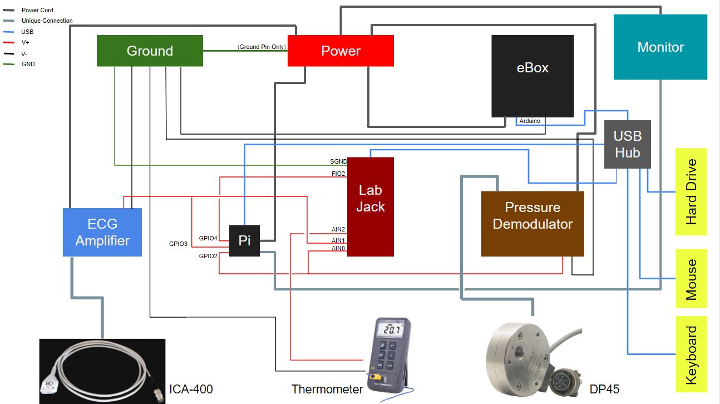
..

**How to Assemble the Switch Sensors:**

1. On the back of the ECG Amplifier, connect the BNC-Banana Adapter to
   the "Amplifier Output".

2. The V+, V-, and GND wiring will need to be fabricated with 18 Gauge
   wiring.

   i.  Connections to the ECG Amplifier and Pressure Demodulator need to
       be made with Banana Plugs.

   ii. Connection to the Thermometer needs to be made with the Phone
       Jack.

3. The V+ wires connecting sensors to AIN0, AIN1, and AIN2 ports of the
   Labjack will need to be connected to Female Jumper Wires that plug
   into GPIO pins 2, 3, and 4 on the Raspberry Pi, respectively. This
   can be done in one of two ways:

   i.  Put both the sensor V+ end and the GPIO Jumper Wire end in the
       same port of the Labjack.

   ii. Solder the Female Jumper Wires to the sensor V+ wire.

**Software Installation Instructions**
--------------------------------------

1. Download or transfer the files "Berryconda3-2.0.0-Linux-armv7l.sh"
   and "setup_PCC.sh" to pi folder.

2. Transfer "PCCv45.py" and "run_PCC.sh" to the desktop.

3. In command terminal, type and execute: chmod +x
   Berryconda3-2.0.0-Linux-armv7l.sh setup_PCC.sh Desktop/run_PCC.sh

4. Run "Berryconda3-2.0.0-Linux-armv7l.sh" in the pi folder.

5. Restart the pi.

6. In command terminal, type and execute: conda create -n py36
   python=3.6

7. Run "setup_PCC.sh" file in the pi folder.

8. Restart the pi.

9. "run_PCC.sh" program is ready to execute.
